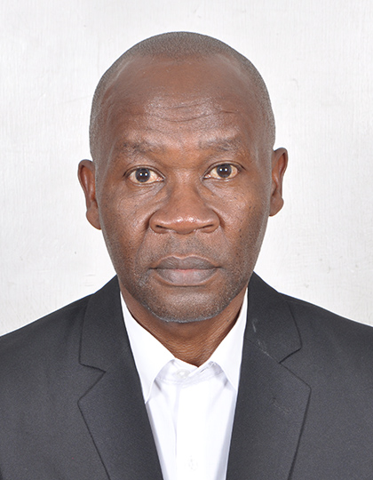
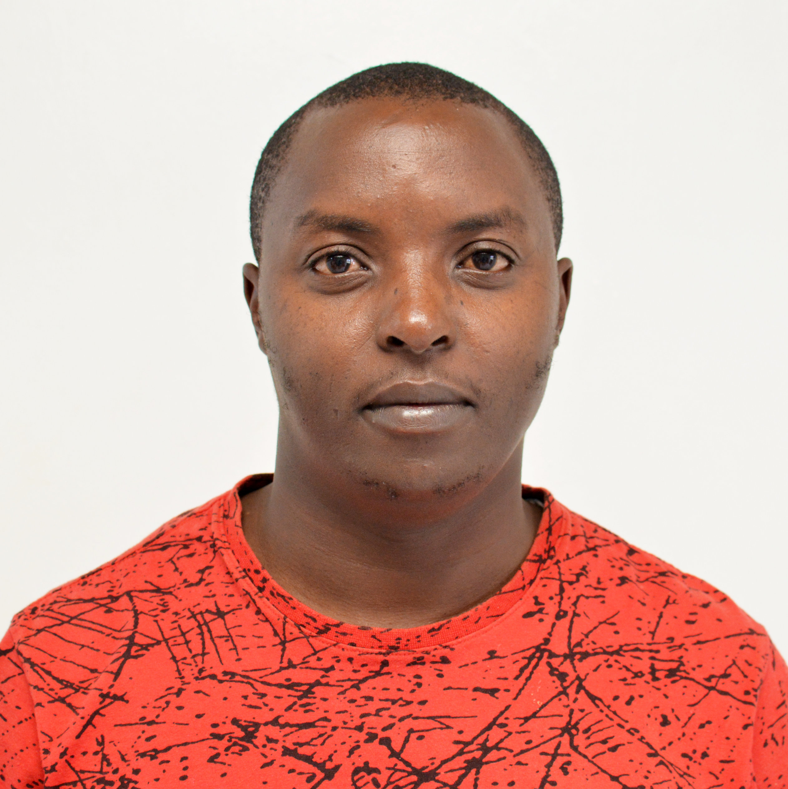
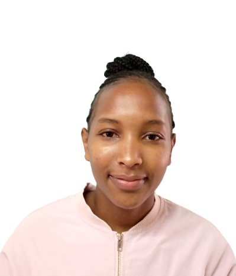

<!-- <link rel="stylesheet" href="/assets/css/custom.css"> -->
<head>
    
</head>

# **ABOUT US**

    The Materials Modelling Group is based at the Technical University of Kenya.
    We are dedicated in contributing to the advancement of theoretical and computational
    material science.
    Our research focuses on predicting and understanding properties of
    materials using <i>first principles</i> codes such as
    <abbr title="Quantum ESPRESSO">
        <a href="https://www.quantum-espresso.org/" target="_blank">QE,</a>
    </abbr>
    <abbr title="Vienna Ab initio Simulation Package">
        <a href="https://www.vasp.at/" target="_blank">VASP,</a>
    </abbr>
    <abbr title="Spanish Initiative for Electronic Simulations with Thousands of Atoms">
        <a href="https://siesta-project.org/siesta/" target="_blank">SIESTA,</a>
    </abbr>
    <a href="https://abinit.github.io/abinit_web/" target="_blank">ABINIT</a> and
    <a href="https://www.yambo-code.eu/" target="_blank">YAMBO.</a>
    The Materials Modelling Group is composed of researchers with expertise in condensed matter
    physics and computational techniques. The team includes faculty members and graduate students,
    all working collaboratively to address various research questions.

# **Our Members**

    

        
        
Prof. George Amolo

    

    <!--%%%%%%%%%%%%-->
    

        
        
Dr. Mike Atambo

    

    <!--%%%%%%%%%%%%-->
    

        
        
Dr. Robert Onyancha

    

    <!--%%%%%%%%%%%%-->
    

        
        
Dr. Mirriam Chepkoech

    

     <!--%%%%%%%%%%%%-->
    

        
        
Dr. Gladys King'ori

    

    <!--%%%%%%%%%%%%-->
    

        
        
Perpetua Muchiri

    

    <!--%%%%%%%%%%%%-->
    <!--%%%%%%%%%%%%-->
    

        
        
Carolyne Bakasa

    

    <!--%%%%%%%%%%%%-->
    

        
        
Renson

    

    <!--%%%%%%%%%%%%-->
    <!--%%%%%%%%%%%%-->
    

        
        
Bill Clintone

    

    <!--%%%%%%%%%%%%-->
    

        
        
Stephen Chege

    

    <!--%%%%%%%%%%%%-->
    

        
        
Leah Wairimu

    

    <!--%%%%%%%%%%%%-->
    

        
        
Charles Rotich

    

